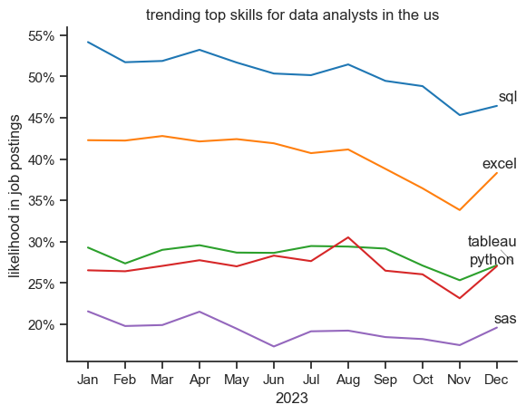
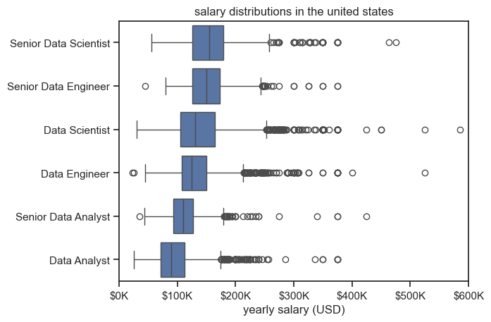
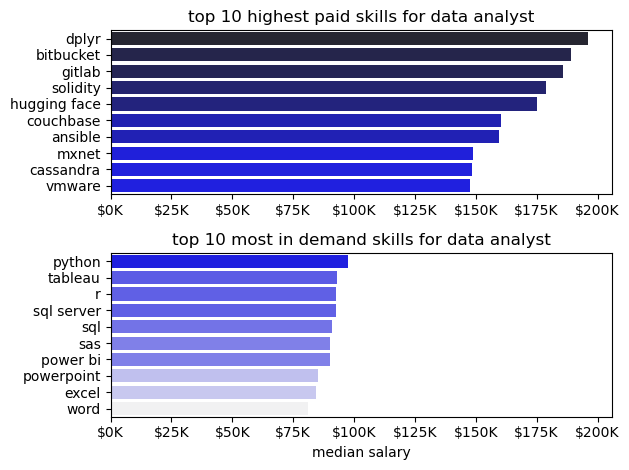

# Overview 

Welcome to my exploration of the data analyst job market, with a focus on identifying high-value career opportunities. This project emerged from my journey to understand which skills truly matter in data analytics—not just the most popular ones, but those that offer the best combination of strong salaries and reasonable market demand.

The dataset comes from Luke Barousse's Python Course, which served as the foundation for my hands-on learning in Python for data science and analytics. Through practical Python analysis, I investigated critical questions including: Which skills are most frequently requested? What salary ranges can data analysts expect? And most importantly, where do high demand and high compensation intersect to create "optimal" skill investments?

This analysis aims to provide actionable insights for aspiring and current data analysts looking to strategically develop their skillsets in an increasingly competitive market.


# The Questions

Below are the questions I want to answer in my project

1. What are the skills most in demand for the top 3 most popular data roles?
2. How are in-demand skills trending for Data Analyst?
3. How well do jobs and skills  pay for Data Analysts?
4. What are the optimal skills for data analysts to learn?

# Tools I Used

For my analysis of the data analyst job market, I leveraged several essential tools to extract meaningful insights:

- Python: The core of my analysis, enabling me to process data and uncover key trends. I utilized the following Python - - 

- libraries:
   1. Pandas Library: For data manipulation and analysis, allowing me to clean, transform, and explore the dataset efficiently.
   2. Matplotlib Library: To create foundational visualizations that reveal patterns in the data.
   3. Seaborn Library: For generating more sophisticated and aesthetically refined visualizations, including the optimal skills scatter plot.

- Jupyter Notebooks: My primary environment for running Python scripts, combining code execution with markdown notes to document my analytical process.

- Visual Studio Code: My preferred code editor for writing and debugging Python scripts with enhanced productivity features.

- Git & GitHub: Critical for version control and project sharing, allowing me to track changes, collaborate effectively, and showcase my work publicly.


# Data Preparation and Cleanup

This section outlines the steps taken to prepare the data for analysis, ensuring accuracy and usability.


# Import & Clean Up Data

The foundation of any solid analysis begins with properly importing and preparing the data. Here's how I approached this critical first step:

Importing the Data
I loaded the dataset directly from Luke Barousse's curated collection using the Hugging Face datasets library, which provided seamless access to real-world job market data:

```python

import ast
import pandas as pd
import seaborn as sns
from datasets import load_dataset
import matplotlib.pyplot as plt

# Load the dataset
dataset = load_dataset('lukebarousse/data_jobs')
df = dataset['train'].to_pandas()

```

Data Cleaning Process
To ensure accuracy in my analysis, I performed essential data transformations:

1. Date Standardization: Converted the job_posted_date column to datetime format, enabling time-based analysis and ensuring consistent date handling throughout the project.

```python

df['job_posted_date'] = pd.to_datetime(df['job_posted_date'])

```
2. Skills Data Parsing: Transformed the job_skills column from string representations of lists into actual Python lists using ast.literal_eval(). This was crucial for analyzing individual skills across job postings while safely handling any missing values.

```python

df['job_skills'] = df['job_skills'].apply(lambda x: ast.literal_eval(x) if pd.notna(x) else x)

```

This cleaned and structured dataset provided a reliable foundation for exploring skill demand, salary trends, and identifying optimal career opportunities in the data analyst job market.


# The Analysis

## 1. What are the most demanded skills for the top 3 most popular data roles

To find the most demanded skills for the top 3 most popular data roles. I filtered out those positions by which ones were the most popular, and got the top 5 skills for these top 3 roles. This query highlights the most popular job titles and their top skills, showing which skills I should pay attention to depending on the role I'm targetting.


View my notebook with detailed steps here:
[2_skill_demand.ipynb](C:\Projects\data_project\project\2_skill_demand.ipynb)

### Visualize Data
```python
fig, ax= plt.subplots(len(job_titles),1)

for i,job_title in enumerate(job_titles):
    df_plot=df_skills_perc[df_skills_perc['job_title_short']==job_title].head(5)
    df_plot.plot(kind='barh',x='job_skills',y='skill_percent',ax=ax[i],title=job_title)
    ax[i].invert_yaxis()
    ax[i].set_ylabel('')
    ax[i].legend().set_visible(False)
fig.suptitle('likelihood of skills required in us job postings', fontsize=15)
fig.tight_layout(h_pad=0.5)#fix the overlap
plt.show()
```

### Results


*Bar graphs visualizing the likelihood of skills required in US job postings across Data Analyst, Data Engineer, and Data Scientist roles.*

### Insights
- Python dominates across all three roles - Python is the most sought-after skill for Data Scientists (~65%) and Data Engineers (~60%), and ranks second for Data Analysts (~27%). This suggests Python has become the universal language of data work, regardless of specialization.
- SQL is universally critical but especially for analysts - SQL appears in the top skills for all three positions, but it's particularly emphasized for Data Analysts (~50%) where it actually matches or exceeds Python. This reflects that analysts spend much of their time querying databases directly, while scientists and engineers may work more with preprocessed data or streaming systems.
- Role specialization is reflected in tool diversity - Each role has distinct secondary tools: Data Analysts favor visualization tools (Excel ~40%, Tableau ~28%), Data Engineers focus on cloud platforms (AWS ~40%, Azure ~30%) and big data tools (Spark ~27%), while Data Scientists emphasize statistical tools (R ~42%). This shows that while foundational skills overlap, each role requires specialized technical knowledge aligned with its core responsibilities.


# The Analysis

## 2. How are in-demand skills trending for Data Analysts?

### Visualize Data

```python

sns.lineplot(data=df_plot,dashes=False,palette='tab10')
sns.set_theme(style='ticks')
sns.despine()
plt.title('trending top skills for data analysts in the us')
plt.ylabel('likelihood in job postings')
plt.xlabel('2023')
plt.legend().remove()

#we neeed our yaxis values to be in percent format
#therefore with the help of set_major_formatter method we will do it


#first get the current axis
ax=plt.gca()
#now we will access the yaxis and apply the percent formatter method
ax.yaxis.set_major_formatter(PercentFormatter(decimals=0))


#we need to give the text for each line therefore we will apply a for loop
#Creates an empty list to store all the text labels
texts = []

#Loops 5 times (once for each skill line)
for i in range(5):
    #For each skill: adds a text label at position x=11.5 (right side), y=the last data point value, with the skill name as text. Saves each label to the list.
    texts.append(plt.text(11.5, df_plot.iloc[-1,i], df_plot.columns[i]))

#Automatically moves the labels so they don't overlap, and draws thin gray lines connecting labels to their original positions if they were moved
adjust_text(texts, arrowprops=dict(arrowstyle='-', color='gray', lw=0.5))

```

### Results



*Bar graph visulizing the trending top skills for data analysts in the US in 2023.*

### Insights
- SQL dominates but is declining: SQL consistently appears in about 45-55% of data analyst job postings throughout 2023, making it by far the most in-demand skill. However, it shows a notable downward trend from its January peak of ~54% to around 46% by December, suggesting either market saturation or a shift in job requirements.
- Excel remains surprisingly resilient: Despite being a traditional tool, Excel holds steady as the second most requested skill at around 40-42% for most of the year. It only dips significantly in the final months (dropping to ~34% in November), which could indicate a seasonal variation or a gradual shift toward more advanced analytics tools.
- Python and Tableau are neck-and-neck for third place: Both skills hover around 25-30% throughout the year with Python (red line) showing slightly more volatility, including a notable spike in August (~30%) before declining. By year-end, they're nearly tied at about 26-27%, suggesting these visualization and programming skills are similarly valued but haven't yet reached the ubiquity of SQL or Excel.


# The Analysis

## 3. How well do jobs and skills pay for data analysts?


### Salary Analysis for Data Nerds

#### Visualize Data

```python

sns.boxplot(data=df_US_top6, x='salary_year_avg',y='job_title_short',order=job_order)
sns.set_theme(style='ticks')

plt.title('salary distributions in the united states')
plt.xlabel('yearly salary (USD)')
plt.ylabel('')
plt.xlim(0,600000)
#funcformatter is used to reset labels using the lambda function; for every y divide it by 1000 to remove the decimal places and put a $before and K after and everything inside an f string
ticks_x=plt.FuncFormatter(lambda y, pos: f'${int(y/1000)}K')
plt.gca().xaxis.set_major_formatter(ticks_x)
plt.show()

```

#### Results



*Box plot visualizing the salary distributions for the top 6 data job titles.*


#### Insights
- Clear hierarchy with seniority and specialization: Senior roles command significantly higher salaries than their non-senior counterparts. Senior Data Scientists and Senior Data Engineers have median salaries around $150-160K, compared to roughly $110-130K for Data Scientists and Data Engineers. The "Senior" prefix translates to approximately $30-40K in additional median compensation.
- "Scientist" roles out-earn "Analyst" and "Engineer" roles: At every level, positions with "Scientist" in the title show higher salary distributions than "Analyst" roles, and are roughly comparable to or slightly above "Engineer" roles. Data Analysts have the lowest median salary (around $100K), while Senior Data Scientists sit at the top of the hierarchy. This suggests that statistical modeling and research-oriented skills command a premium.
- High earner outliers are most common in "Scientist" roles: The scatter points show that Data Scientists and Senior Data Scientists have more extreme high-end outliers, with some earning $500-600K+. In contrast, Data Analysts and Senior Data Analysts have fewer outliers and lower salary ceilings, rarely exceeding $400K. This indicates that the compensation ceiling is significantly higher for scientific/research-focused data roles, likely due to opportunities at major tech companies or specialized industries.


# The Analysis
## 4. Highest paid & Most Demanded Skills for Data Analyst

### Visualize Data

```python

#now lets plot this
#since we need to plot 2 plots we use subplots
#2 figures in 1 col
fig, ax=plt.subplots(2,1)

#df_DA_top_pay.plot(kind='barh',y='median' ,ax=ax[0],legend=False)

#now well plot this using seaborn, palette='dark:b_r' here b_r means reverse the dark colors of blue
sns.barplot(data=df_DA_top_pay, x='median', y=df_DA_top_pay.index, ax=ax[0], hue='median',palette='dark:b_r')
ax[0].set_title('top 10 highest paid skills for data analyst')
ax[0].set_ylabel('')
ax[0].set_xlabel('')
ax[0].legend().remove()
#modify the values int the x axis
ax[0].xaxis.set_major_formatter(plt.FuncFormatter(lambda x, _ : f'${int(x/1000)}K'))

#df_DA_skills.plot(kind='barh',y='median',ax=ax[1], legend=False)

#now well plot this using seaborn
sns.barplot(data=df_DA_top_skills, x='median', y=df_DA_stop_kills.index, ax=ax[1],hue='median',palette='light:b')
ax[1].set_title('top 10 most in demand skills for data analyst')
ax[1].set_ylabel('')
ax[1].set_xlabel('median salary')
#modify the x axis set the 2nd graph axis acc to the first one
ax[1].set_xlim(ax[0].get_xlim())
#modify the values in the x axis
ax[1].legend().remove()
ax[1].xaxis.set_major_formatter(plt.FuncFormatter(lambda x, _ : f'${int(x/1000)}K'))

#to avoid overlap
fig.tight_layout()
plt.show()

```

### Results



*Two separate bar graphs visualizing the highest paid skills and most in-demand skills for data analysts in the US.*

### Insights
- Specialized technical skills pay premium, but aren't commonly required: The highest-paid skills (dplyr, bitbucket, gitlab, solidity) command salaries around $175-200K, yet they don't appear at all in the "most in demand" list. Meanwhile, the most demanded skills (Python, Tableau, SQL) offer median salaries only around $90-100K. This reveals a classic supply-demand paradox—niche technical expertise is highly valued but rarely requested, while foundational skills are essential but competitively compensated due to larger talent pools.
- DevOps and infrastructure skills command higher pay: The top-paying skills heavily feature DevOps tools (bitbucket, gitlab, ansible), infrastructure technologies (vmware, cassandra), and version control systems. This suggests that data analysts who can bridge the gap between analytics and engineering/deployment are significantly more valuable, earning roughly 75-100% more than those with only core analyst skills.
- There's a major skills-salary optimization opportunity: Excel and Word appear in the top 10 most demanded skills but would likely offer the lowest compensation gains. Conversely, learning specialized tools like dplyr (R's data manipulation package), modern deployment tools, or blockchain-related skills (solidity) could nearly double earning potential—though job opportunities requiring these skills are much rarer. This suggests data analysts should strategically balance learning highly-demanded foundational skills with selective specialization in premium-paying technologies.


# The Analysis
## 5. What is the most optimal skill to learn for Data Analysts?


#### Visualize Data

```python

#df_plot.plot(kind='scatter',x='skill_percent',y='median_salary')
##now we need to color code this thts why use seaborn
sns.scatterplot(
    data=df_plot,
    x='skill_percent',
    y='median_salary',
    hue='technology'
)

sns.despine()
sns.set_theme(style='ticks')
#prepare text for adjustText
#create an empty list of text
#we are doing this so that each point gets a text(label) so that we understand what each point is representing
texts=[]

for i,txt in enumerate(df_plot['technology']):
    texts.append(plt.text(df_plot['skill_percent'].iloc[i],df_plot['median_salary'].iloc[i],txt))

#adjust text to avoid overlap
adjust_text(texts,arrowprops=dict(arrowstyle='->',color='gray'))

#set axis,labels,title and legend
plt.xlabel('percent of data analyst jobs')
plt.ylabel('median yearly salary')
plt.title('most optimal skills')

#well clean up the salary values on the yaxis
#first get the current axis
#funcformatter is a function used for re labelling using the lambda function
#for every y divide it by 1000 to remove decimals put a $before and K after
ax=plt.gca()
ax.yaxis.set_major_formatter(plt.FuncFormatter(lambda y,pos: f'${int(y/1000)}K'))

#now we will also clean up the x axis and we put the percentformatter to convert the values into percentage
ax.xaxis.set_major_formatter(PercentFormatter(decimals=0))
plt.tight_layout()
plt.show()

```

#### Results


*A scatter plot visualizing the most optimal skills (high paying & high demand) for data analysts in the US.*


#### Insights
- Programming Skills Command Premium Salaries with High Demand: Programming consistently appears in the high-salary range ($90K-$98K) across different demand levels (7%, 33%, and 50% of jobs). This suggests that programming skills are valuable regardless of how common they are in job postings, making them a reliable investment for data analysts seeking higher compensation.

- Cloud Skills Offer the Best Salary-to-Demand Ratio: Cloud skills represent the most "optimal" position on this chart - commanding the highest salary (~$97K) while being required in only about 7% of jobs. This low competition combined with high pay makes cloud skills particularly valuable for differentiation in the job market.

- Analyst Tools Show Declining Returns with Increased Prevalence: As analyst tools become more commonly required (moving from ~10% to ~45% of jobs), the median salary actually decreases from around $90K down to approximately $45K. This suggests that as skills become more commoditized and expected as baseline requirements, they lose their salary premium. The oversupply of candidates with these common tools may be driving compensation down.


# What I Learned

This project significantly expanded my capabilities as a data analyst and deepened my understanding of the job market landscape. Here are the key takeaways from this experience:

- Python Proficiency in Action: Working hands-on with libraries like Pandas for data wrangling, Matplotlib and Seaborn for creating insightful visualizations strengthened my ability to transform raw data into actionable insights efficiently.
- The Critical Role of Data Preparation: I discovered that investing time upfront in cleaning and structuring data—converting data types, parsing nested information, and handling missing values—is essential for producing reliable analysis and avoiding misleading conclusions.
- Data-Driven Career Strategy: This analysis revealed that not all in-demand skills offer equal returns. By examining the intersection of salary and job market demand, I learned to identify "optimal" skills that provide competitive advantages rather than simply chasing the most common requirements.
- Visualization as Communication: Creating clear, well-labeled visualizations taught me that effective data storytelling requires more than just plotting numbers—it demands thoughtful design choices that make complex patterns immediately understandable to any audience.


# Insights

This project revealed several important patterns about the data analyst job market:

- The Optimal Skills Paradox: High salaries don't always correlate with high demand. Specialized skills like cloud computing offer premium compensation (~$97K) despite appearing in only 7% of jobs, while ubiquitous analyst tools show diminishing returns as they become commoditized, with salaries dropping to $45K at higher demand levels.
- Programming as a Consistent Value Driver: Programming skills maintain strong salary levels ($90K-$98K) across varying demand percentages, demonstrating their enduring value regardless of market saturation. This makes them a reliable investment for career growth.
- Strategic Skill Investment: The data clearly shows that focusing on niche, high-value skills provides better career differentiation than accumulating common tools. Understanding where demand meets compensation helps analysts make smarter decisions about which skills to prioritize for maximum market value.


# Challenges I Faced

This project presented several valuable learning obstacles that strengthened my analytical abilities:

- Text Label Overlaps in Visualizations: Getting skill labels to display properly without overlapping on the scatter plot was surprisingly tricky. I had to learn to use the adjustText library and understand how enumerate() interacts with DataFrame indices to correctly map labels to data points.
- Data Structure Complexity: Working with the job_skills column, which contained string representations of Python lists, required careful parsing using ast.literal_eval(). Ensuring this transformation handled missing values gracefully while maintaining data integrity was more nuanced than expected.
- Defining "Optimal": Determining what makes a skill "optimal" involved balancing multiple factors—salary, demand, and career trajectory. This required iterative analysis and critical thinking about what metrics truly matter for career planning, not just what's easiest to measure.


# Conclusion

This deep dive into the data analyst job market has provided valuable clarity on how to navigate career decisions strategically in this dynamic field. The analysis revealed that success isn't just about acquiring the most popular skills, but rather identifying those that offer the optimal balance of market demand and compensation potential.

The insights gained from this project—particularly around the premium value of specialized skills like cloud and programming versus the commoditization of common analyst tools—offer a practical roadmap for career development. As the data landscape continues to evolve, the analytical approach demonstrated here can be applied repeatedly to stay informed about emerging opportunities.

This project represents more than just an analysis; it's a testament to the power of data-driven decision making in career planning. It reinforces that continuous learning, strategic skill development, and regular market assessment are essential for long-term success in data analytics. The Python skills and analytical frameworks I've developed through this work will serve as a strong foundation for future projects and deeper explorations into the ever-changing world of data.
