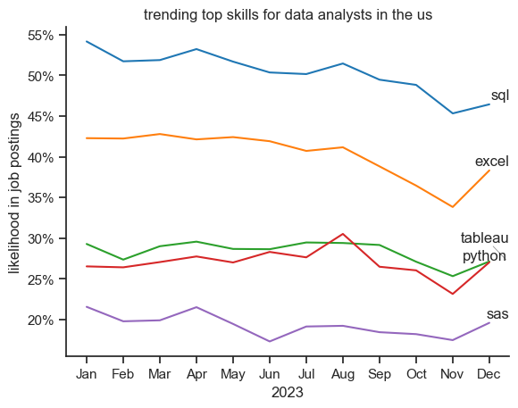

# The Analysis

## 1. What are the most demanded skills for the top 3 most popular data roles

To find the most demanded skills for the top 3 most popular data roles. I filtered out those positions by which ones were the most popular, and got the top 5 skills for these top 3 roles. This query highlights the most popular job titles and their top skills, showing which skills I should pay attention to depending on the role I'm targetting.


View my notebook with detailed steps here:
[2_skill_demand.ipynb](C:\Projects\data_project\project\2_skill_demand.ipynb)

### Visualize Data
```python
fig, ax= plt.subplots(len(job_titles),1)

for i,job_title in enumerate(job_titles):
    df_plot=df_skills_perc[df_skills_perc['job_title_short']==job_title].head(5)
    df_plot.plot(kind='barh',x='job_skills',y='skill_percent',ax=ax[i],title=job_title)
    ax[i].invert_yaxis()
    ax[i].set_ylabel('')
    ax[i].legend().set_visible(False)
fig.suptitle('likelihood of skills required in us job postings', fontsize=15)
fig.tight_layout(h_pad=0.5)#fix the overlap
plt.show()
```

### Results


### Insights
- Python dominates across all three roles - Python is the most sought-after skill for Data Scientists (~65%) and Data Engineers (~60%), and ranks second for Data Analysts (~27%). This suggests Python has become the universal language of data work, regardless of specialization.
- SQL is universally critical but especially for analysts - SQL appears in the top skills for all three positions, but it's particularly emphasized for Data Analysts (~50%) where it actually matches or exceeds Python. This reflects that analysts spend much of their time querying databases directly, while scientists and engineers may work more with preprocessed data or streaming systems.
- Role specialization is reflected in tool diversity - Each role has distinct secondary tools: Data Analysts favor visualization tools (Excel ~40%, Tableau ~28%), Data Engineers focus on cloud platforms (AWS ~40%, Azure ~30%) and big data tools (Spark ~27%), while Data Scientists emphasize statistical tools (R ~42%). This shows that while foundational skills overlap, each role requires specialized technical knowledge aligned with its core responsibilities.


# The Analysis

## 2. How are in-demand skills trending for Data Analysts?

### Visualize Data

```python

sns.lineplot(data=df_plot,dashes=False,palette='tab10')
sns.set_theme(style='ticks')
sns.despine()
plt.title('trending top skills for data analysts in the us')
plt.ylabel('likelihood in job postings')
plt.xlabel('2023')
plt.legend().remove()

#we neeed our yaxis values to be in percent format
#therefore with the help of set_major_formatter method we will do it


#first get the current axis
ax=plt.gca()
#now we will access the yaxis and apply the percent formatter method
ax.yaxis.set_major_formatter(PercentFormatter(decimals=0))


#we need to give the text for each line therefore we will apply a for loop
#Creates an empty list to store all the text labels
texts = []

#Loops 5 times (once for each skill line)
for i in range(5):
    #For each skill: adds a text label at position x=11.5 (right side), y=the last data point value, with the skill name as text. Saves each label to the list.
    texts.append(plt.text(11.5, df_plot.iloc[-1,i], df_plot.columns[i]))

#Automatically moves the labels so they don't overlap, and draws thin gray lines connecting labels to their original positions if they were moved
adjust_text(texts, arrowprops=dict(arrowstyle='-', color='gray', lw=0.5))

```

### Results


*Bar graph visulizing the trending top skills for data analysts in the US in 2023.*

### Insights:
- SQL dominates but is declining: SQL consistently appears in about 45-55% of data analyst job postings throughout 2023, making it by far the most in-demand skill. However, it shows a notable downward trend from its January peak of ~54% to around 46% by December, suggesting either market saturation or a shift in job requirements.
- Excel remains surprisingly resilient: Despite being a traditional tool, Excel holds steady as the second most requested skill at around 40-42% for most of the year. It only dips significantly in the final months (dropping to ~34% in November), which could indicate a seasonal variation or a gradual shift toward more advanced analytics tools.
- Python and Tableau are neck-and-neck for third place: Both skills hover around 25-30% throughout the year with Python (red line) showing slightly more volatility, including a notable spike in August (~30%) before declining. By year-end, they're nearly tied at about 26-27%, suggesting these visualization and programming skills are similarly valued but haven't yet reached the ubiquity of SQL or Excel.