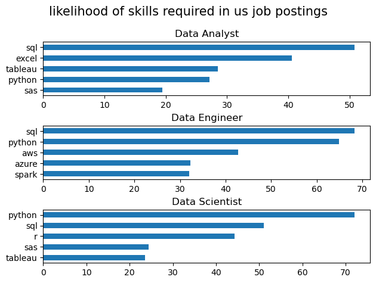

# The Analysis

## 1. What are the most demanded skills for the top 3 most popular data roles

To find the most demanded skills for the top 3 most popular data roles. I filtered out those positions by which ones were the most popular, and got the top 5 skills for these top 3 roles. This query highlights the most popular job titles and their top skills, showing which skills I should pay attention to depending on the role I'm targetting.


View my notebook with detailed steps here:
[2_skill_demand.ipynb](C:\Projects\data_project\project\2_skill_demand.ipynb)

### Visualize Data
```python
fig, ax= plt.subplots(len(job_titles),1)

for i,job_title in enumerate(job_titles):
    df_plot=df_skills_perc[df_skills_perc['job_title_short']==job_title].head(5)
    df_plot.plot(kind='barh',x='job_skills',y='skill_percent',ax=ax[i],title=job_title)
    ax[i].invert_yaxis()
    ax[i].set_ylabel('')
    ax[i].legend().set_visible(False)
fig.suptitle('likelihood of skills required in us job postings', fontsize=15)
fig.tight_layout(h_pad=0.5)#fix the overlap
plt.show()
```

### Results



### Insights
- Python dominates across all three roles - Python is the most sought-after skill for Data Scientists (~65%) and Data Engineers (~60%), and ranks second for Data Analysts (~27%). This suggests Python has become the universal language of data work, regardless of specialization.
- SQL is universally critical but especially for analysts - SQL appears in the top skills for all three positions, but it's particularly emphasized for Data Analysts (~50%) where it actually matches or exceeds Python. This reflects that analysts spend much of their time querying databases directly, while scientists and engineers may work more with preprocessed data or streaming systems.
- Role specialization is reflected in tool diversity - Each role has distinct secondary tools: Data Analysts favor visualization tools (Excel ~40%, Tableau ~28%), Data Engineers focus on cloud platforms (AWS ~40%, Azure ~30%) and big data tools (Spark ~27%), while Data Scientists emphasize statistical tools (R ~42%). This shows that while foundational skills overlap, each role requires specialized technical knowledge aligned with its core responsibilities.


